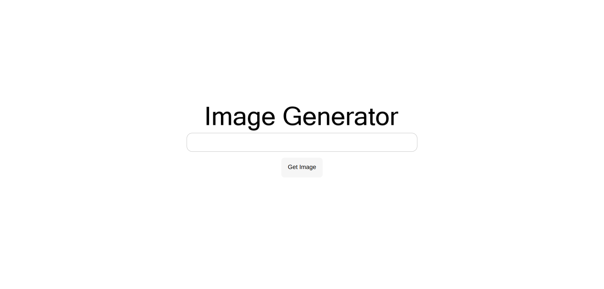
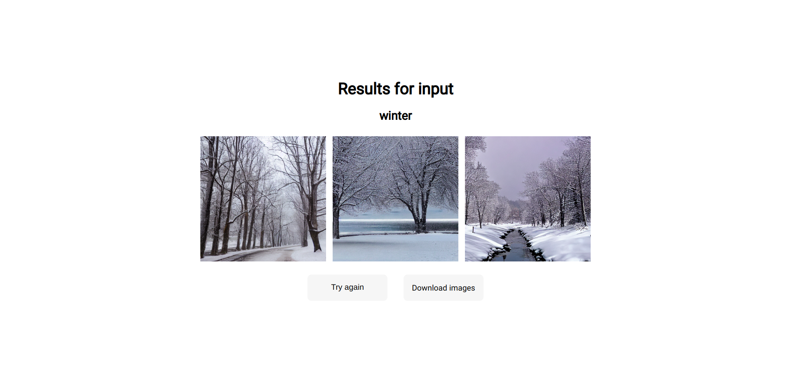
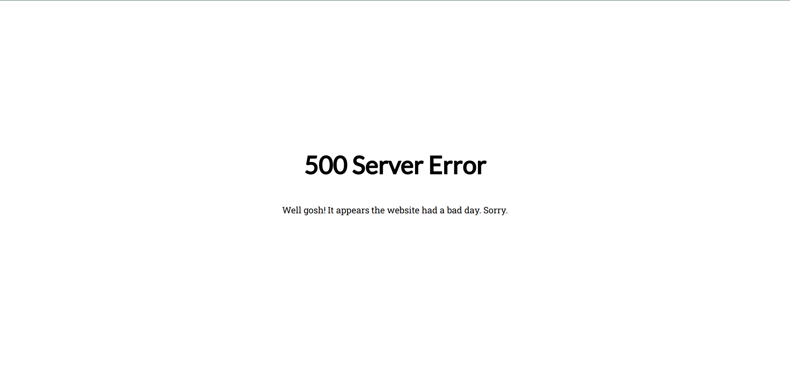
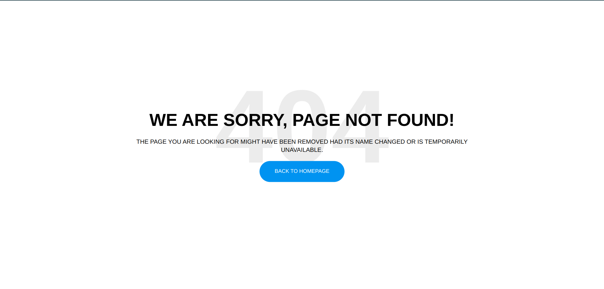

## Веб-сайт

-----------

Ввиду того, что я в первый раз в жизни пишу сайт, а попытки изучения PHP для чайников оказались несколько тщетны, я написал сайт на `flask`, который не поддерживает асинхронность, однако позволяет с относительно небольшими усилиями написать сайт.

Повторюсь, так как я в первый раз в жизни взаимодействую с веб-разработкой, то гарантировать полностью правильность работы во всех браузерах и мобильных устройствах я не могу. Важно, что используются последние возможности JS, из-за чего могут случиться проблемы. Проверена корректность работы в последних версиях Chrome и Opera на ПК, а также Samsung Internet и Chrome на мобильных устройствах.

Перед началом работы нужно сделать несколько небольших действий. Для начала создать виртуальное окружение:

```python3 -m venv venv_server```

активировать его

```source venv_server/bin/activate```

и установить зависимости

```pip install -r requirements.txt```

После чего необходимо создать базу данных, в которой будет храниться информация о пользовательских запросах, и состоять она будет из 3 полей `id` -- уникальный ID сессии, сессия закрывается после закрытия браузера, является основным идентификатором; `edited` -- время последнего изменения статуса и `stat` -- статус пользователя, принимает значения от 0 до 5:

* `0` -- в базе данных нет записей о пользователе, технический, используется только в API
* `1` -- пользователь отправил запрос, ожидание отправки к модели
* `2` -- задание отправлено модели
* `3` -- успешно получен ответ от модели
* `4` -- произошла ошибка (воркер имеет возможность для каждого `id` отправить статус `error`)
* `5` -- данные о сессии необходимо удалить

Для создания базы необходимо перейти в папку `database`

```cd database```

и запустить инициализацию базы

```python3 init_db.py```

Для просмотра содержимого базы можно вызвать файл `test_table.py`

```python3 test_table.py```

Далее вернемся назад и создадим папку `user_data`:

```bash
cd ..
mkdir user_data
```

В этой папке будут храниться данные пользователей. Для того, чтобы данные не накапливались добавим автоудаление. Все записи, что существуют в базе больше получаса сначала помечаются меткой `5`, а затем через полчаса удаляются. Для этого перейдем в папку `garbage_collector`, для логов создадим там папку `logs` и в сессии `tmux` (хотя можно было и через `cron`) запускаем файл `collector.py`. Также все папки, о которых нет записей в базе данных тоже удалятся.

```bash
cd garbage_collector
mkdir logs
python3 collector.py
```

Остались 2 папки: `static` и `templates`. В папке `static` лежат изображения, файлы `.css`, JS-скрипты и т.п. Описывать ее подробно не буду.

В папке `templates` лежат 6 файлов. Часть темплейтов я взял из открытых источников и отредактировал под себя. Разберем их по-очереди:

* `start_page.html` -- стартовая страница, доступ к ней имеется по адресу `https://arnebzero.ru`, имеет одно поле и кнопку, в поле вводится текстовый запрос длины не более 100 символов. Модель генерирует релевантные изображения **только для английского** языка. Текстовый запрос отправляется на страницу `https://arnebzero.ru/get_results?text=<ваш текстовый запрос>`

  

* `loading_results.html` -- на эту страницу мы попадаем со страницы `start_page.html`, если у нас нет в фоне никаких заданий, то нас автоматически перенаправит от запроса `https://arnebzero.ru/get_results?text=<ваш текстовый запрос>` на запрос `https://arnebzero.ru/get_results`, и мы увидем страницу ожидания.

  Данная страница каждые 10 секунд посылает запросы к серверу на предмет того, готовы результаты или нет по API `https://arnebzero.ru/api/v1/ready`, получая статус из базы данных (от `0` до `5`). С случае, если статус равен `3`, идет перенаправление на страницу результов `https://arnebzero.ru/get_results`, в случае если что-то пошло не так, и статус не `1`, `2` или `3`, возвращает на стартовую страницу.

  **Важно!** Данная страница анимирована и использует AJAX в последней версии, это может поддерживаться не во всех браузерах. В таком случае необходимо будет в ручном режиме перезагрузить страницу для просмотра результатов.

  

* `too_many_queries.html` -- эту страницу мы увидим, если попробуем отправить новый запрос, пока старый не пришел, при этом запрос будет иметь вид `https://arnebzero.ru/get_results?text=<ваш текстовый запрос>`. На странице имеется кнопка, которая переведет на страницу `https://arnebzero.ru/get_results`, на которой нужно дождаться выполнения предыдущего запроса. Сделано это с целью некой минимальной защиты от DDoS.

  

* `results.html` -- на эту страницу мы попадем, когда будут готовы результаты. На ней будет отображен наш текстовый запрос и три изображения, сгенерированные по этому запросу. Если изображения понравятся, можно скачать их, получив архив `images.zip`. Или перейти на главную страницу.

  **Важно!** Данные хранятся всего полчаса, после чего они становятся недоступными для скачивания. Также если был отправлен новый запрос, данные также становятся недоступными для скачивания, при этом мы получим ошибку 500.

  

* `500_error.html` -- страница ошибки 500. Так как ее получить относительно сложно, то я сделал специальную страницу `https://arnebzero.ru/error_500`, где можно на нее посмотреть. **Страница анимирована**.

  

* `404_error.html` -- страница ошибки 404, на ней имеется кнопка перехода в начало.

  

Наконец, файл `server.py` -- это собственно основная программа на `flask`, кроме описанного выше также есть два эндпоинта, в которые стучится воркер: 

1. `https://arnebzero.ru/api/v1/get_task`, принимает только метод POST, в JSON должно быть одно поле `"token"`, на основании которого проверяется валидность соединения. Возвращает словарь `{"result": <число заданий>, "data": [<массив заданий с полями "id" и "text">]}`

2. `https://arnebzero.ru/api/v1/send_task`, принимает только метод POST. В JSON должны быть поля `"token"`, `"result"` и `"data"` -- массив словарей с полями `"id"`, `"error"` -- только если произошла ошибка -- и `"images"`. Последнее тоже представляет собой словарь с полями `"0"`, `"1"` и `"2"` -- каждое из которых содержит массив из 512 * 512 * 3 чисел, которые представляют собой изображение. Данные наборы чисел потом с помощью модуля `PIL` конвертируются в изображения.

Также есть два параметра. Секретный ключ, его лучше всего сгенерировать с помощью модуля `secrets`, **необходимо обязательно выставить**. И токен, **он должен быть такой же как и в конфиге воркера**.

Для запуска сайта использовалась следующая инструкция: https://www.digitalocean.com/community/tutorials/how-to-serve-flask-applications-with-uswgi-and-nginx-on-ubuntu-18-04

Чтобы протестировать сервер можно запустить сервер скриптом в `tmux`

```python3 server.py```
